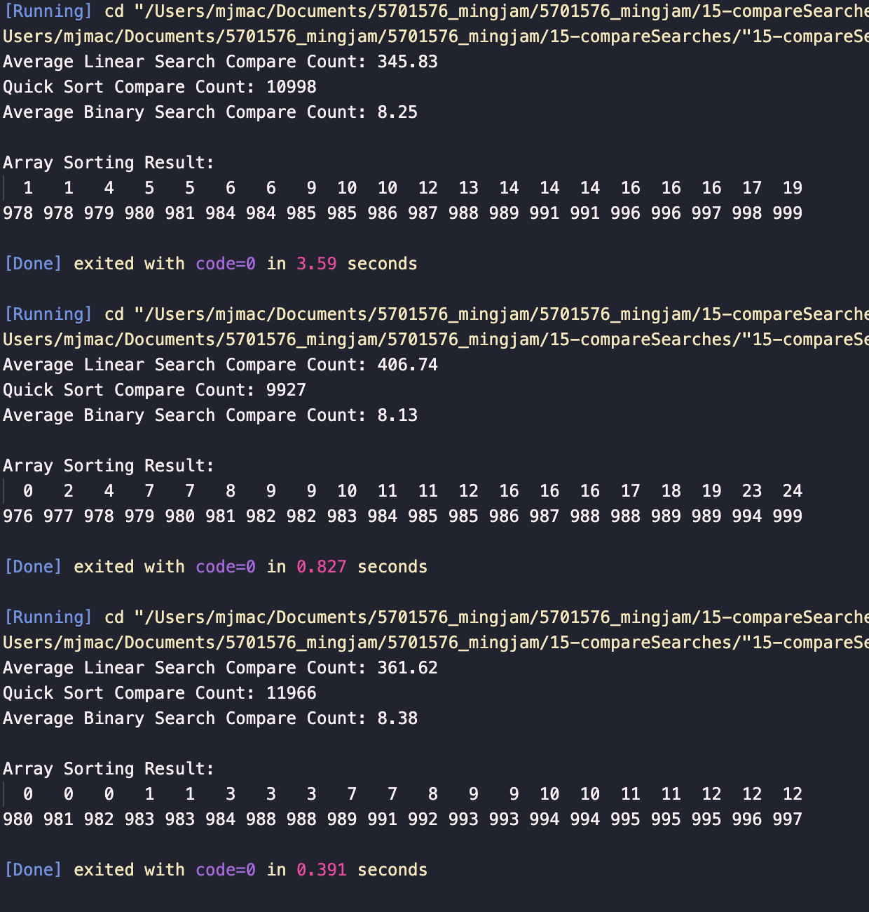
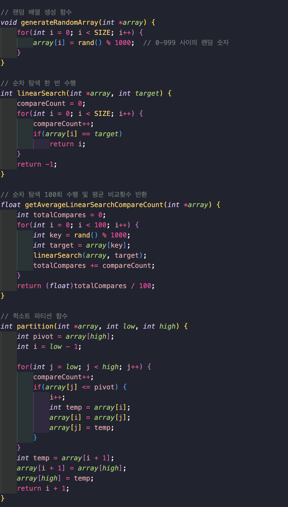
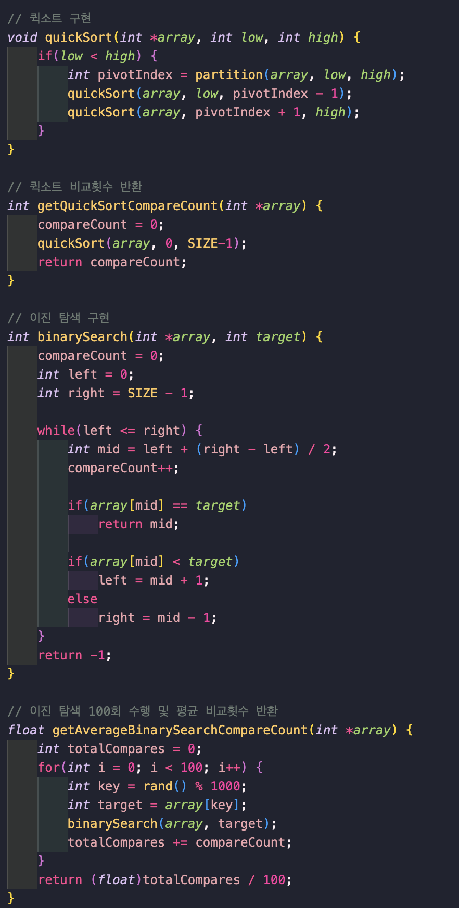

# 탐색 알고리즘 비교 분석

## 실행 결과 분석
프로그램 실행 시 얻은 결과값:
- A (순차 탐색 평균 비교 횟수): 약 300~400회
- B (퀵 정렬 총 비교 횟수): 약 10000회
- C (이진 탐색 평균 비교 횟수): 약 8~9회

## 이진 탐색이 순차 탐색보다 효율적인 이유

### 1. 탐색 방식의 차이
- **순차 탐색 (Linear Search)**
  - 배열의 처음부터 끝까지 순차적으로 검색
  - 평균적으로 배열 크기(n)의 절반인 n/2번 비교 수행
  - 1000개 원소의 경우 평균 300~400번 정도의 비교 발생

- **퀵 정렬 (Quick Sort)**
  - 배열을 분할하고 정렬하는 과정에서 비교 횟수가 많아짐
  - 퀵 정렬의 비교 횟수는 배열의 크기에 따라 증가
  - 1000개 원소의 경우 약 10000회 정도의 비교 발생

- **이진 탐색 (Binary Search)**
  - 정렬된 배열에서 중간값을 기준으로 탐색 범위를 절반씩 줄여감
  - 매 단계마다 탐색 범위가 1/2로 감소
  - log₂n번의 비교로 검색 완료
  - 1000개 원소의 경우 최대 약 8~9번(log₂1000 ≈ 10)의 비교만 필요

### 2. 시간 복잡도 비교
- 순차 탐색: O(n)
- 퀵 정렬: O(n log n)
- 이진 탐색: O(log n)

## 결론
이진 탐색은 초기에 정렬이라는 추가 비용이 필요하지만, 한 번 정렬된 상태에서는 매우 효율적인 탐색이 가능합니다. 특히 대규모 데이터에서 탐색이 빈번하게 발생하는 경우, 초기 정렬 비용을 감수하더라도 이진 탐색을 사용하는 것이 훨씬 효율적입니다. 