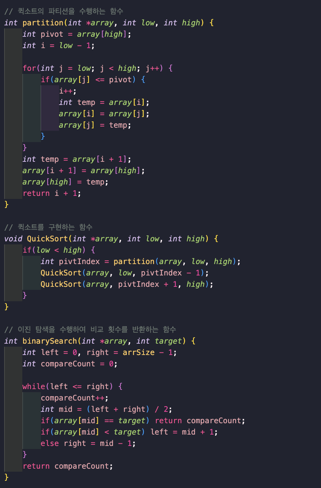

# 보간 탐색(Interpolation Search)과 이진 탐색(Binary Search) 비교 분석

## 비교 횟수가 차이나는 이유

보간 탐색이 이진 탐색보다 평균적으로 더 적은 비교 횟수를 보이는 주요 이유들입니다.

1. **탐색 위치 선정 방식의 차이**
   - 이진 탐색: 항상 중간 위치(`mid = (left + right) / 2`)를 선택
   - 보간 탐색: 데이터의 분포를 고려하여 예측 위치를 선택
     ```c
     pos = low + ((target - array[low]) * (high - low)) / (array[high] - array[low])
     ```

2. **균일 분포된 데이터에서의 성능**
   - 데이터가 균일하게 분포된 경우:
     - 이진 탐색: O(log n)
     - 보간 탐색: O(log(log n))

## 성능 차이가 발생하는 상황

1. **최적의 경우**
   - 데이터가 균일하게 분포된 경우 보간 탐색이 매우 효율적
   - 예: 1, 2, 3, 4, 5와 같이 일정한 간격으로 정렬된 데이터

2. **최악의 경우**
   - 데이터가 불균일하게 분포된 경우 보간 탐색의 효율성 감소
   - 예: 1, 2, 4, 8, 16과 같이 지수적으로 증가하는 데이터

