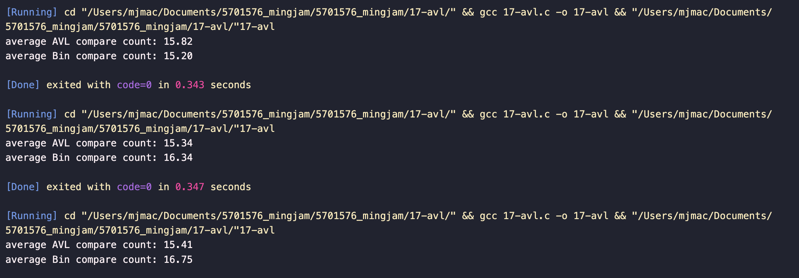
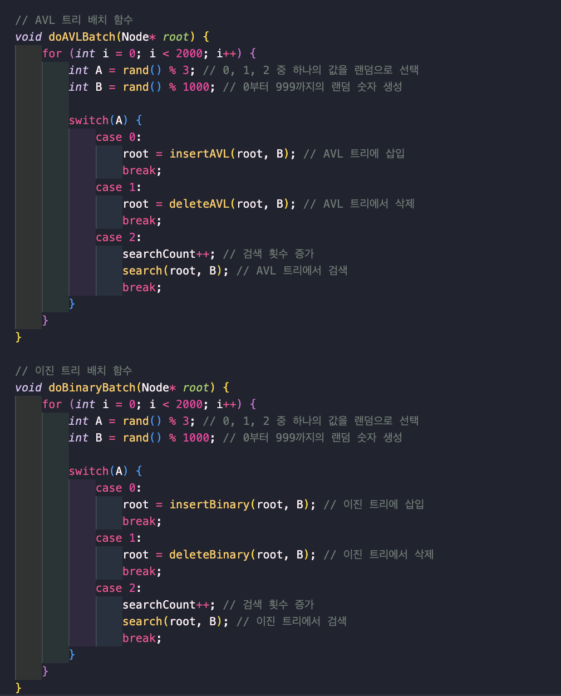
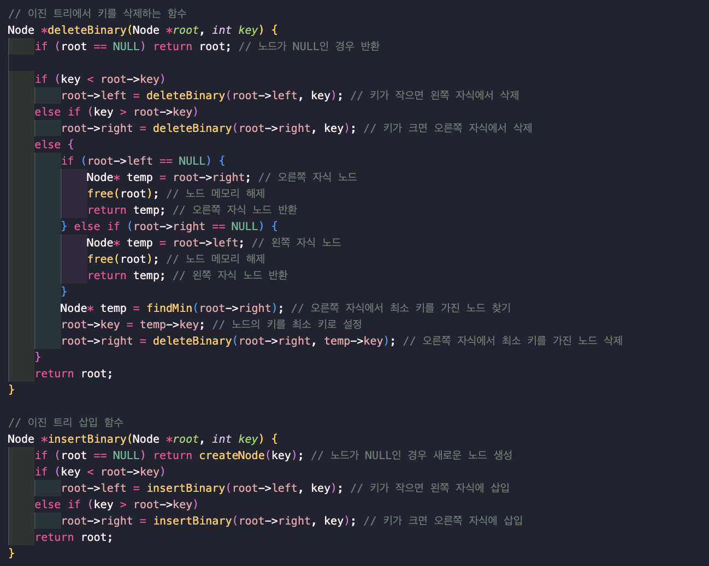
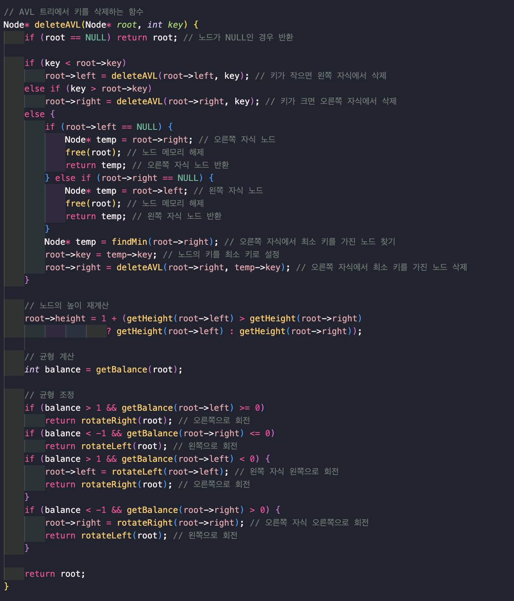
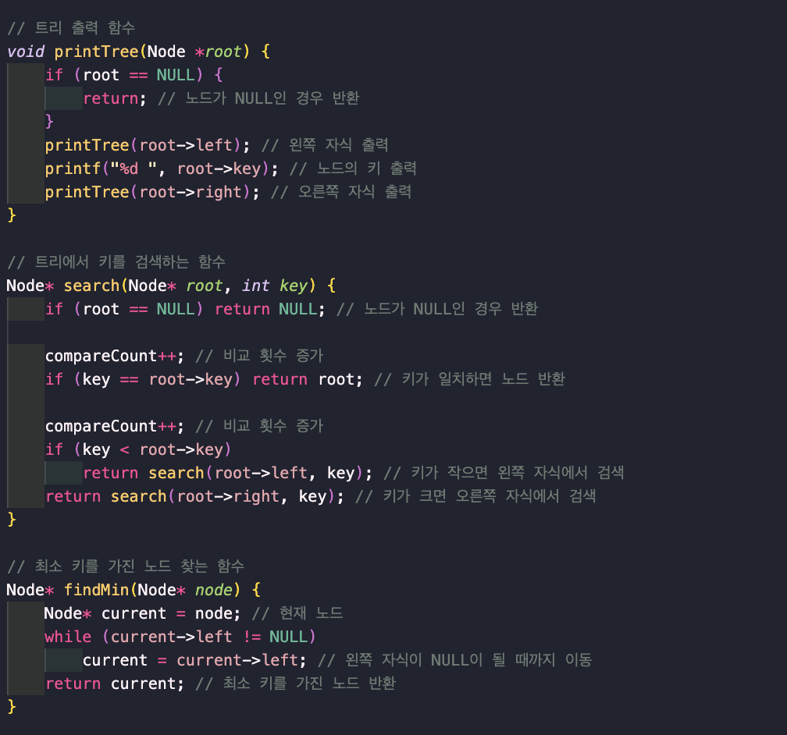
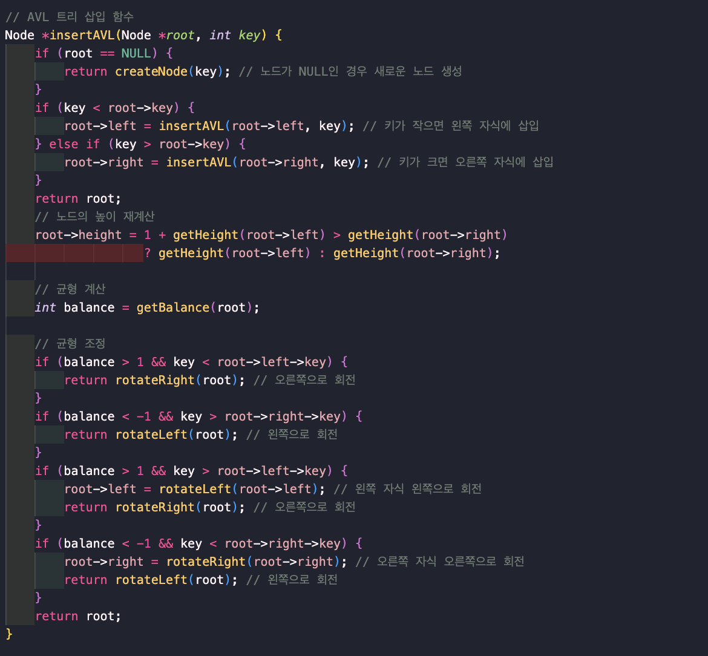
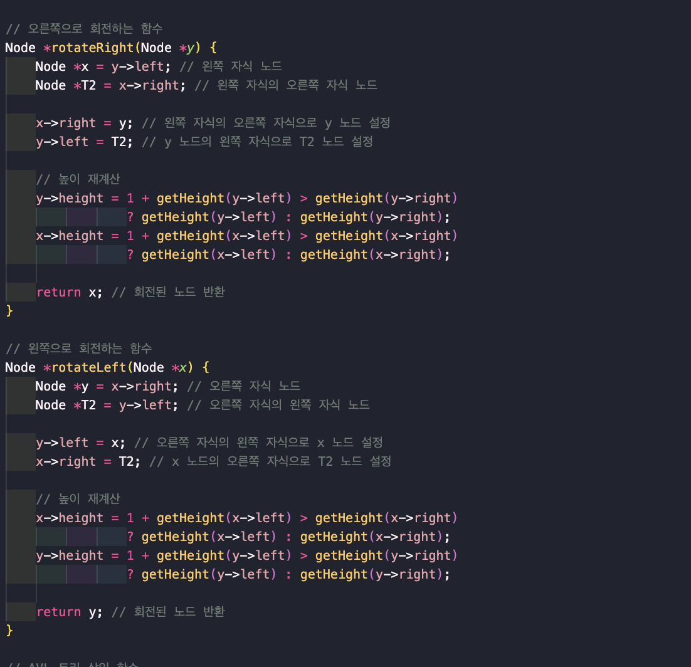
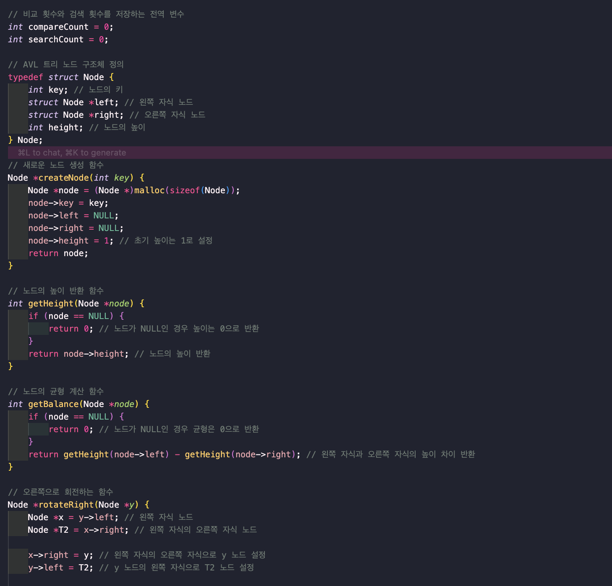

### 결과 분석

이진 탐색 트리와 AVL 트리에서 탐색의 비교횟수를 비교분석한 내용을 README파일에 자세하게 작성합니다.

이진 탐색 트리는 트리의 균형을 유지하지 않기 때문에 최악의 경우에는 O(n)의 시간 복잡도를 가질 수 있습니다. 반면에 AVL 트리는 균형을 유지하기 때문에 최악의 경우에도 O(log n)의 시간 복잡도를 가집니다.

따라서, 이진 탐색 트리는 데이터가 정렬되어 있을 때 성능이 떨어지는 반면에 AVL 트리는 항상 일정한 성능을 보장합니다. 이러한 이유로 AVL 트리가 더 나은 선택일 수 있습니다.

